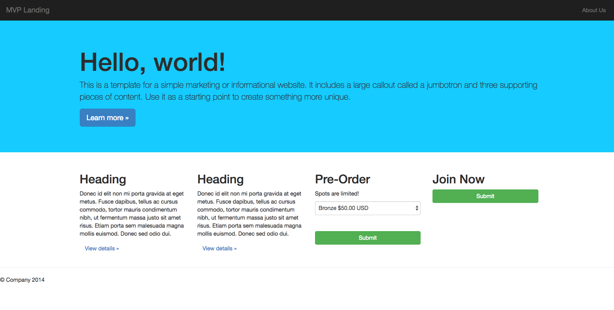

MVP_Landing_Page
================

# Introduction

A mock web store which is built with the Django Python framework. This application supports the ability to place orders, review order details, delete orders, and update order details.

# Source

The source code is based fromt the [Coding for Entrepreneurs](https://www.youtube.com/playlist?list=PLEsfXFp6DpzRgedo9IzmcpXYoSeDg29Tx) series.

# Notes

Each commit is roughly when each video ends. Large changes are broken into smaller commits
